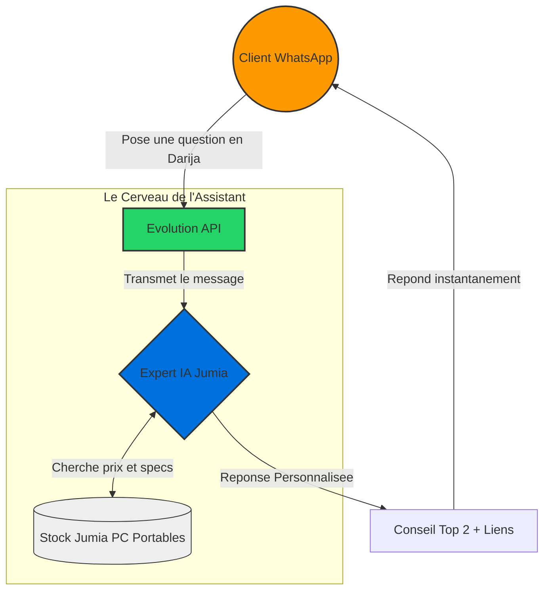

# 🏗️ Architecture du Projet - Compagnon Notebook Jumia

Ce document contient la vision simplifiée du projet pour présentation.

## 🛍️ Parcours Client (IA Personal Shopper)

### 📊 Schéma Graphique
(Nécessite l'extension VS Code : *Markdown Preview Mermaid Support*)



### 📝 Schéma de Synthèse (Lecture Immédiate)

```text
1. L'UTILISATEUR 📱
   Envoie un message WhatsApp (Darija/Fr)
   Ex: "Bghit PC rkhis l-qraya" (Je veux un PC pas cher pour les études)

2. LA PASSERELLE 📨 (Evolution API)
   Reçoit le message et l'envoie à l'Intelligence Artificielle.

3. L'EXPERT IA 🧠 (Moteur RAG)
   - Analyse le besoin (Etudes = RAM 8Go, Processeur efficace).
   - Fouille dans le catalogue Jumia (Qdrant DB).
   - Sélectionne les 2 meilleures offres du moment.

4. LE CONSEIL 🎁
   L'utilisateur reçoit :
   - Le nom complet des 2 PC.
   - Les specs techniques simplifiées.
   - Une petite phrase d'encouragement en Darija.
   - Les liens directs pour acheter.
```

---

## 💡 Points Clés de Présentation

- **Accessibilité** : Utilisation de WhatsApp, sans barrière technique pour l'utilisateur.
- **Culturel** : Compréhension du **Darija technique** (mélange de marocain et de termes informatiques).
- **RAG (Retrieval Augmented Generation)** : L'IA ne "raconte" pas d'histoires, elle puise ses réponses exclusivement dans le catalogue réel de Jumia.
- **Expertise Métier** : Capacité de filtrage par usage (Gaming, Études, Montage) au lieu de simples mots-clés.
